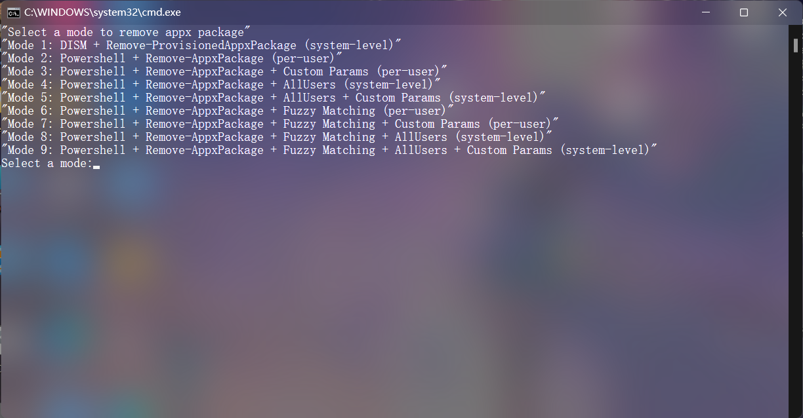

  
# Appx Package Manager Community

###  说明
一个用于管理（安装、查看已安装的、卸载）microsoft store（容器）应用的小工具, 用于在右键菜单添加快捷安装选项，可选择系统级或用户级模式来进行安装或卸载，还可以通过注册xml来把松散文件注册成microsoft store（容器）应用.

注意:

* xml注册需要在系统设置打开开发者选项才能使用.

### 安装
从release [下载AppxPackageManagerCommunity.zip文件（从github actions构建得到）](https://github.com/nzl-architecture/Appx_Package_Manager_Community_For_Windows/releases)，完全解压后运行install.ps1即可安装

### 软件主界面

### 支持查看当前已安装的microsoft store（容器）应用

### 支持卸载当前已安装的microsoft store（容器）应用，用户级和系统级均可

### 支持.appx、.msix、.appxbundle、.msixbundle软件包的安装

#### 绑定.appx、.msix、.appxbundle、.msixbundle等格式的右键菜单

#### 安装microsoft store（容器）应用时的页面

可以选4个模式
* 系统级安装+默认参数
* 用户级安装+默认参数
* 系统级安装+自定义参数
* 用户级安装+自定义参数

#### 卸载microsoft store（容器）应用时的页面

可以选9个模式
* 系统级卸载预配包+默认参数
* 用户级卸载+默认参数
* 用户级卸载+自定义参数
* 系统级卸载+默认参数
* 系统级卸载+自定义参数
* 软件包名模糊匹配+用户级卸载+默认参数
* 软件包名模糊匹配+用户级卸载+自定义参数
* 软件包名模糊匹配+系统级卸载+默认参数
* 软件包名模糊匹配+系统级卸载+自定义参数

### 支持直接注册文件夹的appxmanifest.xml来注册成软件包（需要在系统设置打开开发者模式）

#### 绑定.xml格式的右键菜单

#### 通过松散文件注册软件包时的页面

